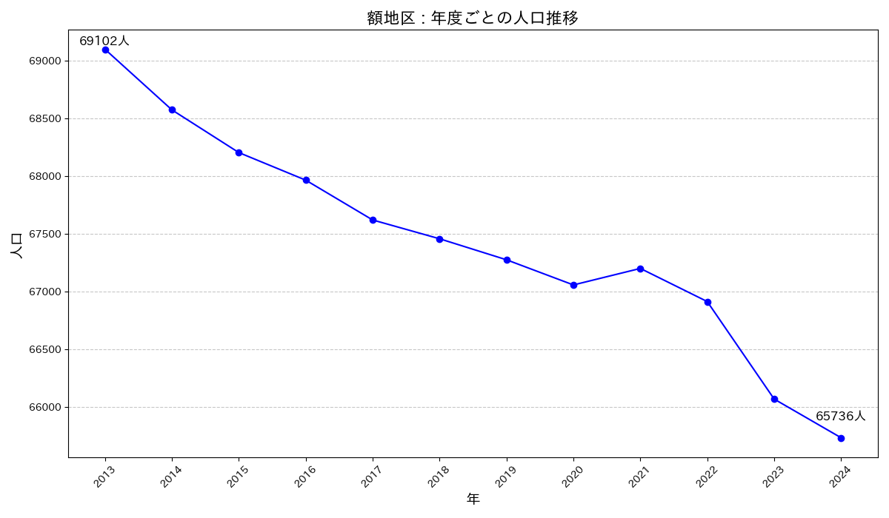

# nuka-Population-trends
金沢市額地区の人口推移を調査するリポジトリです。

## このリポジトリの成果物
2013年~2024年までの人口推移です。


## 必要なツール
- `curl`

## セットアップ
1. 以下のページから配布されているエクセルファイルをダウンロードし、`data`ディレクトリに配置します。  
   [金沢市人口データ配布ページ](https://www4.city.kanazawa.lg.jp/soshikikarasagasu/chosatokeishitsu/gyomuannai/1/3/2/7855.html)  
2. 一括ダウンロードには`makefile`を利用すると便利です。
   - `make init`を実行すると、2012年から2024年までの人口データが`data`ディレクトリにダウンロードされます。

## ディレクトリ構成

```bash
$ tree -I venv
.
├── README.md
├── data
│   ├── gbrm42499.xls
│   ├── gbrm42599.xls
│   ├── ...（省略）
│   └── gbrm50612.xls
├── main.ipynb
├── makefile
├── nuka_population_trend.png
├── plot.ipynb
├── requirements.txt
└── result.csv

1 directory, 20 files
```

- **`nuka_population_trend.png`**  
  金沢市額地区の2013年から2024年までの人口推移グラフを表しています。
- **`main.ipynb`**  
  エクセルデータを処理して`result.csv`を生成するためのスクリプトです。
- **`plot.ipynb`**  
  `result.csv`から額地区の人口推移グラフを生成するスクリプトです。
- **`result.csv`**  
  汎用的な形式で額地区の人口データをまとめたファイルです。

## 注意事項
- `result.csv`は公開データを元に生成されており、他の用途にも適宜ご利用いただけます。